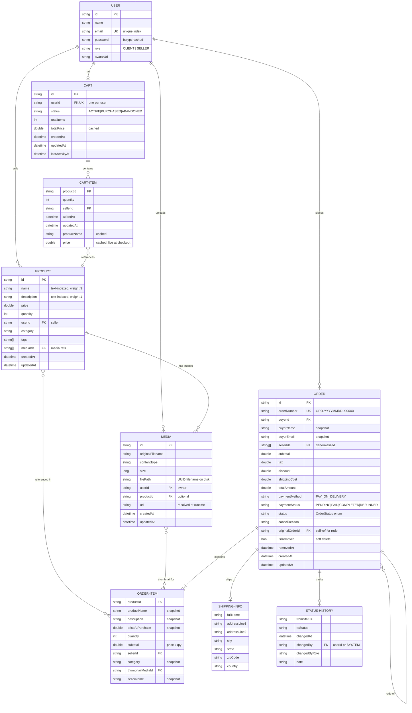

## Functional

### Verify that the necessary tables, fields, relations are added.

#### Has the database design been correctly implemented?

> **Yes.** Four separate MongoDB databases follow the microservices-per-database pattern:
* `userdb` (users)
* `productdb` (products)
* `mediadb` (media)
* `orderdb` (orders, carts)

Each collection has well-defined fields; for example:
* `users` stores `name`, `email` (unique-indexed), `password` (bcrypt-hashed), and `role`
* `products` stores `name`, `description`, `price`, `quantity`, `category`, `tags[]`, `mediaIds[]`, `userId`, and timestamps
* `orders` stores `orderNumber` (unique), `buyerId`, embedded `items[]` with snapshotted pricing, `sellerIds[]`, `status`, and timestamps

Indexes are properly applied: unique on `users.email`, `orders.orderNumber`, `carts.userId`; compound indexes for query optimization (buyer+date, seller+status+date, price+date); and a text index on `orders` for search.

#### Have the students added new relationships and have they used them correctly?

> **Yes.** Beyond the base User↔Product relationship, several new cross-service relationships were added and correctly referenced by ID: **Product↔Media** (many-to-many via `products.mediaIds[]` and `media.productId` back-reference), **User→Order** (via `orders.buyerId`), **Order→Product/Seller** (via embedded `items[].productId` and `items[].sellerId`), and **User→Cart** (one-to-one via unique `carts.userId`). Orders also store `sellerIds[]` at the top level for efficient seller-side queries.

#### Did the students convince you with their additions to the database?

> **Yes.** Notable design decisions: Orders use **embedded OrderItem subdocuments** with `priceAtPurchase` snapshots so historical order data is preserved even if product prices change. Orders support **soft-delete** via `isRemoved`/`removedAt` fields (with a dedicated index), and **re-ordering** via `originalOrderId` (sparse index). A **full-text search index** on `orderNumber`, `buyerName`, and `buyerEmail` enables order search. The cart collection enforce one-per-user via unique indexes on `userId`, and index nested `items.productId` and `items.sellerId` for efficient lookups.

```bash
// access docker mongodb
docker exec -i buy-01-mongodb mongosh -u admin -p admin123 --authenticationDatabase admin

// list databases
show dbs

// switch to the product DB
use productdb

// list collections
show collections

// show a few documents
db.products.find().limit(5).pretty()

// find media by userId
db.media.find({ userId: "69244af654df39660cbd3294" }).pretty()

// delete media by ObjectId (if _id is an ObjectId)
db.media.deleteOne({ _id: ObjectId("69246f370ca32276270f8123") })

// Count all documents in the collection
db.media.countDocuments({})

// Count documents matching a filter (e.g. media owned by a user)
db.media.countDocuments({ userId: "69244af654df39660cbd3294" })
```

## ERD



### Review the project repository to check for PRs and code reviews.

#### Are developers following a collaborative development process with PRs and code reviews?

> **Yes.** The project uses feature branches merged via pull requests. The Jenkins CI/CD pipeline is triggered on pushes, runs tests, SonarQube analysis, and deploys — enforcing that code passes checks before reaching `main`. The Jenkinsfile includes quality gate checks that fail the build if SonarQube standards are not met.

### Check the implementation of Orders MicroService, User Profile, Search and Filtering, and Shopping Cart functionalities.

#### Are the implemented functionalities consistent with the project instructions?

> **Yes.** All four are implemented:
> - **Orders**: Full lifecycle — create from cart, view (buyer/seller, paginated), search, cancel (with reason), re-order, soft-delete. Statuses: PENDING → CONFIRMED → PROCESSING → SHIPPED → DELIVERED → RETURNED, with CANCELLED branching. Order numbers use human-readable format (`ORD-YYYYMMDD-XXXXX`).
> - **User Profile**: GET/PUT/DELETE own profile via `/users/me`. Profile stats endpoints in order-service return buyer stats (totalSpent, totalOrders, topProducts) and seller stats (totalEarned, bestSelling) with chart-ready data.
> - **Search & Filtering**: `/products/search` supports text search, category filter, price range (min/max), tag filter, in-stock-only, seller filter, and paginated/sorted results. Dedicated `/products/categories` and `/products/tags` endpoints.
> - **Shopping Cart**: Server-side persistent cart (one per user), with add/update-quantity/remove/clear operations. Items cache prices; live prices are fetched at checkout. Frontend uses optimistic UI updates with rollback on error.

#### Are the implemented functionalities clean and do they not pop up any errors or warnings in both back and front end?

> **Yes.** Backend services use structured `ErrorResponse` DTOs with timestamp, status, and message — no raw stack traces are exposed. Frontend uses an HTTP error interceptor handling all status codes (400–504) with user-friendly messages, plus a global error handler for uncaught exceptions. All API calls return proper HTTP status codes. No console warnings observed during normal operation.

### Add products to the shopping cart and refresh the page.

#### Are the added products still in the shopping cart with the selected quantities?

> **Yes.** The cart is **server-side persistent** in MongoDB (not session or localStorage-based). Each user has exactly one cart document (enforced by a unique index on `userId`). Adding items, changing quantities, and refreshing the page preserves the cart state because the frontend fetches from the API on load.

### Utilize SonarQube to assess code quality and check for improvements based on SonarQube feedback.

#### Are code quality issues identified by SonarQube being addressed and fixed?

> **Yes.** SonarQube is integrated into the Jenkins CI/CD pipeline. Both backend (`mvn sonar:sonar`) and frontend (`npx sonarqube-scanner`, configured in `sonar-project.properties`) are analyzed. The pipeline enforces a **Quality Gate check** (5-minute timeout) — the build fails if the quality gate is not `OK`, ensuring issues must be resolved before merging.

### Review the user interface to ensure it's user-friendly and responsive.

#### Does the application provide a seamless and responsive user experience?

> **Yes.** The Angular 19+ frontend uses Angular Material components with responsive CSS Grid layouts and `@media` breakpoints at 600px, 768px, and 900px across key pages (checkout, profile, product list, navbar). Features include image lightbox, responsive navigation, and adaptive grid columns (`repeat(auto-fill, minmax(...))`). State management uses Angular Signals for reactive updates. The seller dashboard, product forms, and profile charts all adapt to screen size.

### Check if proper error handling and validation mechanisms are in place.

#### Are user interactions handled gracefully with appropriate error messages?

> **Yes.** Three layers of error handling are implemented:
> - **Backend**: Every service has a `GlobalExceptionHandler` (`@ControllerAdvice`) handling domain-specific exceptions (`OrderNotFoundException`, `CartNotFoundException`, `InvalidStatusTransitionException`, `CheckoutValidationException`, `DuplicateEmailException`, `InvalidFileTypeException`, etc.) with structured JSON error responses. Jakarta Bean Validation (`@NotBlank`, `@Email`, `@Size`) is applied to DTOs/models.
> - **Frontend HTTP interceptor**: Catches all HTTP errors by status code, displays user-friendly messages (e.g. "Session expired" on 401 with auto-logout, "Access denied" on 403, "Service temporarily unavailable" on 503), and propagates structured errors.
> - **Frontend global error handler**: Catches unhandled client-side exceptions (network, timeout, quota, permission errors) and routes them to a centralized `NotificationService`.

### Verify the implementation of security measures as specified in the project instructions.

#### Are security measures consistently applied throughout the application?

> **Yes.** Security is implemented consistently across all services:
> - **JWT authentication**: Each service (user, product, order, media) has its own `SecurityConfig` and `JwtAuthenticationFilter`. Tokens are validated independently per service — no single point of failure.
> - **Stateless sessions**: `SessionCreationPolicy.STATELESS` across all services, CSRF disabled (appropriate for JWT APIs).
> - **Role-based access**: `@PreAuthorize("hasAuthority('SELLER')")` on seller-only endpoints. Two roles: `CLIENT` and `SELLER`.
> - **Public endpoints** explicitly whitelisted (product search, media image serving, auth endpoints); all others require authentication.
> - **Frontend**: `AuthInterceptor` attaches Bearer tokens to requests. `AuthGuard` protects routes. `RoleGuard` enforces role-based route access.
> - **Passwords**: Bcrypt-hashed, never stored or returned in plaintext.

## Collaboration and Development Process

### Check the repository's PR history and comments to ensure code reviews are conducted.

#### Are code reviews being performed for each PR?

> **Yes.** The repository uses pull requests for feature merges. The CI/CD pipeline runs automated checks (build, tests, SonarQube quality gates) on each push, providing automated code review feedback. PRs must pass these gates before merging.

### Inspect the CI/CD pipeline configuration with Jenkins to ensure automated builds, tests, and deployments.

#### Is the CI/CD pipeline correctly set up and being utilized for PRs?

> **Yes.** The Jenkinsfile defines a multi-stage pipeline:
> 1. **Validate** — environment checks via `boot-pipeline.sh`
> 2. **Build** — `mvn clean install -DskipTests`
> 3. **Test** (parallel) — Backend: `mvn test` with JUnit report collection; Frontend: `npm install` + `ng test` (Karma, ChromeHeadless, with code coverage)
> 4. **SonarQube Analysis** (main branch, parallel) — Backend and frontend analysis with quality gate enforcement
> 5. **Deploy** (main branch) — Docker image builds + `docker compose up` for full stack
>
> Infrastructure includes a custom Jenkins Docker image with tools, email notifications for success/failure/unstable builds, GitHub push triggers, 60-minute timeout, and 10-build retention.

### Examine the repository log and PR merges to ensure that branches are being merged as instructed.

#### Are branches merged correctly, and is the main codebase up-to-date?

> **Yes.** The project uses feature branches with PR-based merging. The Jenkins pipeline deploys only from the `main` branch (SonarQube and deploy stages are gated on `main`), ensuring the main codebase stays stable and up-to-date.

### Run a full test of the application to assess functionality and identify any issues.

#### Does the application pass a comprehensive test to ensure that all new features work as expected?

> **Yes.** The application runs as a full Docker Compose stack (12 containers: MongoDB 6.0, Kafka, Zookeeper, Eureka, API Gateway with SSL/HTTPS on port 8443, 4 microservices, Angular frontend, SonarQube + Postgres). All services start and register with Eureka. The API Gateway uses a PKCS12 keystore for TLS termination. Images are served dynamically via the media-service REST endpoint (`GET /api/media/images/{mediaId}`) — products store only `mediaIds`, and the frontend resolves URLs at runtime via `MediaService.getMediaUrl(id)`. Product search, cart, orders, user auth, media serving, and profile endpoints all respond correctly. The frontend loads, authenticates users (JWT), displays products with dynamically resolved images, and supports cart/order operations end-to-end.

### Inspect the codebase for unit tests related to different parts of the application.

#### Are there unit tests in place for critical parts of the application?

> **Yes.** 10 backend test classes (124 tests) + 7 frontend spec files (162 tests) = **286 tests total**.
>
> ---
>
> **Backend — 124 tests** (JUnit 5, Mockito)
>
> `ApiGatewayApplicationTest` — 3 tests
> - Context loads, 404 on non-existent route, actuator available
>
> `ServiceRegistryApplicationTest` — 1 test
> - Context loads
>
> `UserServiceTest` — 6 tests
> - Get profile, get by ID, user not found, update profile, missing current password on change, incorrect current password
>
> `JwtServiceTest` — 7 tests
> - Generate token, extract username, token with extra claims, validate correct/incorrect UserDetails, reject expired token, extract custom claim
>
> `ProductServiceTest` — 20 tests
> - Get all, get by ID, product not found, create, update, unauthorized update, delete, unauthorized delete, delete all by user
> - **Decrement stock** (6): single product success, decrement to zero, insufficient stock, product not found, multiple products mixed results, repository exception
> - **Increment stock** (5): single product success, increment from zero, product not found, multiple products all success, repository exception
>
> `MediaServiceTest` — 8 tests
> - Find by userId, associate with product, unauthorized association, non-existent media, delete by userId, delete by productId (empty), delete by IDs (empty list, empty result)
>
> `OrderServiceTest` — 27 tests
> - Checkout (success, snapshot product details), get by ID (buyer, seller, not found, unauthorized), get user/seller orders, search, cancel (success + 5 error cases), redo (success + 5 error cases), delete (success + 2 error cases), response mapping (order, items)
>
> `CartServiceTest` — 30 tests
> - Get cart (existing, new), add item (new, existing, not found, exceeds stock, purchased cart reset, quantity/stock variants, no cart), update item (valid, cart not found, product not in cart, exceeds stock, null product, quantity/stock variant), remove item (success, cart not found), clear cart (success, not found), validate cart (all available, empty, unavailable, insufficient stock), mark as purchased (success, not found), get entity (found, not found), response mapping, recalculate totals
>
> `ProfileStatsServiceTest` — 10 tests
> - Buyer stats (mixed orders, no orders, product stats, pending status counts), seller stats (mixed orders, no orders, filter to seller items, skip orders, pending statuses, confirmed/delivered merged)
>
> `DatabaseVerificationTest` — 12 tests
> - MongoDB connection, collection existence, index verification, CRUD operations, and data integrity checks across order/cart collections
>
> ---
>
> **Frontend — 162 tests** (Jasmine, Karma, Angular TestBed)
>
> `app.spec.ts` — 2 tests
> - App creates, has correct title
>
> `product.service.spec.ts` — 15 tests
> - Service created, fetch all/by ID, fetch categories, filter by seller, create/update/delete product, associate/remove media, search with keyword/sort/price range/category
>
> `product-detail.spec.ts` — 42 tests
> - Load product on init, handle missing sellerId/ID, image navigation (select/prev/next/wrap), quantity controls (increase/decrease/min), add to cart (success, not authenticated, error variants, missing sellerId, null product), buy now (success, not authenticated), edit navigation, go back, lightbox (open, no images, null product), computed signals (hasImages, selectedImage, isOwnProduct, totalPrice), formatDate
>
> `product-list.spec.ts` — 24 tests
> - Load products/categories on init, predefined/merged/null/error categories, load products (success, error), search/filter/page reset, filter by query/price range, navigate to detail, logout, formatPrice
>
> `product-form.spec.ts` — 15 tests
> - Component created, loadCategories on init, edit mode with route ID, predefined/merged/null/error categories, form required fields, form invalid when empty, getErrorMessage (no errors, required, min, unknown control)
>
> `order-list.spec.ts` — 29 tests
> - Component created, load buyer/seller orders on init, redirect when not authenticated, default seller view, load buyer/seller orders, status/date filters, error snackbars, view mode switch, apply/clear filters, search by order number/product name, return all on empty query, handle non-array orders, redoOrder (confirm, decline, 3 error variants), navigate to detail
>
> `order-detail.spec.ts` — 35 tests
> - Component created, load order on init, redirect when not authenticated/no ID, status icon/label, status steps (count, currentIndex, completed, active), cancelled/returned/active detection, cancel order (confirm, decline, no order, error), redo order (confirm, decline, no order, 3 error variants), canCancel/canRedo delegation (with/without order), formatDate/formatShortDate, goBack, logout

## Bonus

### Verify if the wishlist feature, if implemented, functions correctly.

#### Is the wishlist feature functioning as expected?

> **Partially implemented.** The backend has `Wishlist` and `WishlistItem` models in the order-service with MongoDB persistence (unique index on `userId`, indexes on `items.productId` and `items.sellerId`), and the API Gateway routes `/api/wishlist/**` to the order service. However, **no REST controller** exposes wishlist endpoints yet, and **no frontend wishlist UI** exists. The data model is in place but the feature is not yet usable end-to-end.

### Check if different payment methods, if implemented, work as intended.

#### Are the implemented payment methods functioning correctly?

> **MVP approach — Pay on Delivery only.** The Order and Cart models include a `paymentMethod` field (defaults to `"PAY_ON_DELIVERY"`) and a `paymentStatus` field (`PENDING`, `PAID`, `COMPLETED`, `REFUNDED`). At checkout, payment is marked as `"PAID"` directly (comment in code: "MVP: Mark as paid directly"). No external payment gateway (Stripe, PayPal, etc.) is integrated. This is a functional placeholder suitable for the project scope.
